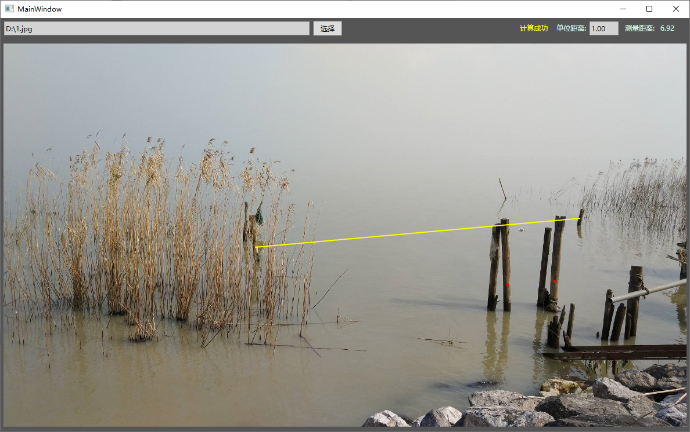

# LaserEye

A simple measurement helper for laser distance measurement devices.

## Screenshot

## Principle

We use two parallel laser beams that cast two dots on the target.
Since the distance between the dots is known, when the distance between the dots on the target is measured, the distance between the device and the target can be calculated using a simple affine transformation (仿射变换).

Of course, this calculation ignored the affection of distortion.

## Usage

I think it is simple enough that you can figure it out yourself by just clicking around.
